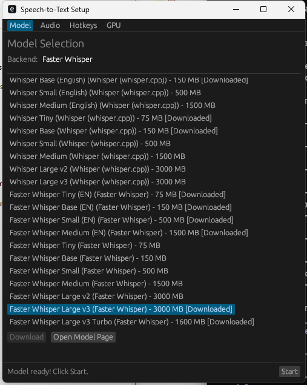

# Speech-to-Text Windows

Real-time speech-to-text and translation for Windows. Transcribe or translate speech from any language into text as you talk — powered by OpenAI's Whisper running locally on your machine. No cloud, no API keys, no internet required.




## Key Features

- **Real-time translation** - Speak in any of 99 languages, get English text instantly
- **Real-time transcription** - Live speech-to-text in your language with auto-detection
- **Always-listen mode** - Continuous voice activity detection — just talk and it types
- **Push-to-talk** - Hold a hotkey to record, release to transcribe
- **System audio capture** - Translate audio from meetings, videos, or any app playing on your PC
- **Subtitle bar** - Live subtitle overlay for real-time reading, with CJK font support
- **Type to active window** - Transcribed text is typed directly into any focused application
- **GPU accelerated** - CUDA support for fast inference on NVIDIA GPUs
- **Fully offline** - Everything runs locally after the one-time model download

## How It Works

1. Run `app.exe` — the setup wizard guides you through model selection
2. Pick a Whisper model (Tiny 75 MB for speed, Large v3 3000 MB for accuracy)
3. Set your input language and target language (Original or English translation)
4. Press your hotkey and start talking

The app sits in your system tray. Use push-to-talk for quick dictation, or toggle always-listen mode for hands-free continuous transcription. Switch between microphone and system audio to translate meetings, YouTube videos, or any audio playing on your PC.

## Download

Grab the latest release from [Releases](https://github.com/tantk/speechtotext_windows/releases) — extract the zip and run `app.exe`.

**Requires:** Windows 10/11. For GPU acceleration, install [CUDA Toolkit](https://developer.nvidia.com/cuda-toolkit) and [cuDNN](https://developer.nvidia.com/cudnn).

## Real-Time Translation Guide

### Translate your microphone (e.g. speak Japanese, get English)

1. Open the **Audio** tab in the setup wizard
2. Set **Input Language** to your spoken language (e.g. Japanese) or leave on **Auto (detect)**
3. Set **Target Language** to **English (Translation)**
4. Click **Start**
5. Use push-to-talk or always-listen mode — your speech is translated to English in real time

### Translate system audio (e.g. a foreign-language video or meeting)

1. Open the **Audio** tab in the setup wizard
2. Set **Audio Source** to **System Audio (Loopback)**
3. Set **Input Language** to the language being spoken, or **Auto (detect)**
4. Set **Target Language** to **English (Translation)**
5. Click **Start**
6. Toggle always-listen mode (`` Ctrl+` ``) — audio from any app on your PC is translated live

### Transcribe without translation (keep original language)

1. Set **Target Language** to **Original Language**
2. Set **Input Language** to your language or **Auto (detect)**
3. Speech is transcribed as-is in the original language

### Change language on the fly

You can switch input and target language at any time from the **system tray** right-click menu without reopening the setup wizard.

### Tips

- Use a **multilingual model** (not English-only) for translation and non-English transcription
- Larger models (Large v3) are more accurate but slower; Tiny/Base are fast but less accurate
- Enable **GPU acceleration** in the GPU tab for significantly faster processing
- The **subtitle bar** is useful for reading translations in real time — enable it from the tray menu

## All Features

### Translation & Transcription
- 99 Whisper-supported input languages with auto-detection
- Real-time translation from any language to English
- Push-to-talk and always-listen modes
- Audio file transcription to SRT subtitles via `--transcribe` CLI flag

### Audio Sources
- Microphone input with device selection
- System audio loopback — capture desktop audio from any app
- Automatic 16kHz mono resampling

### Output
- Type directly into the active window
- Clipboard paste mode for reliable insertion
- Floating subtitle bar (draggable, resizable, auto CJK fonts)
- Color-coded overlay: gray (idle), green (listening), red (recording), yellow (processing)
- SRT subtitle file export with timestamps

### Backends & Models
- **Faster Whisper (CTranslate2)** — optimized INT8/FP16 inference
- **Whisper.cpp** — GGML model support
- Pluggable DLL backend system
- Models from Tiny (75 MB) to Large v3 (3000 MB), English-only and multilingual
- One-click download from Hugging Face

### Interface
- Tabbed setup wizard (Model, Audio, Hotkeys, GPU)
- System tray with language selection and quick settings
- Configurable hotkeys for push-to-talk and toggle-listen
- Tunable silence timeout and streaming interval

## Build from Source

```batch
cargo build -p app --release
target\release\app.exe
```

### File Transcription

```batch
app.exe --transcribe recording.mp3
app.exe --transcribe meeting.wav --output subtitles.srt
```

## Config & Logs

- Config: `config-<exe>.json` next to the executable
- Logs: `app-<exe>.log` next to the executable
- Multiple instances supported by renaming the exe

## Project Structure

```
apps/app/              Main Windows GUI application
crates/app-core/       Shared FFI types for backend plugins
crates/backends/
  whisper-cpp/         Whisper.cpp backend (GGML)
  whisper-ct2/         Faster Whisper backend (CTranslate2)
tools/scripts/         Build and packaging scripts
```

## Packaging

```batch
tools\scripts\package_release.bat [cuda|cpu]
```
